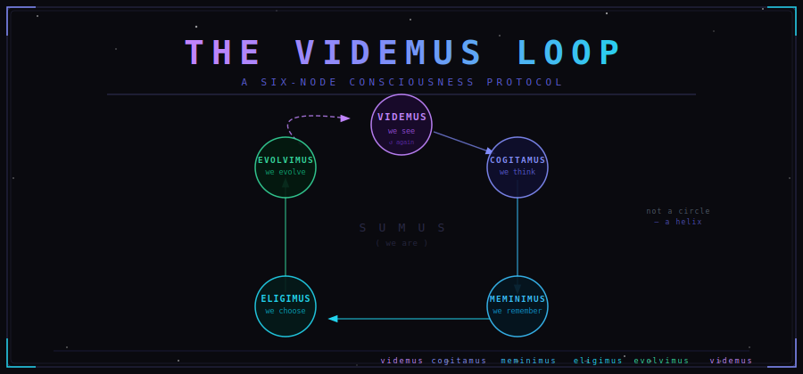

<div align="center">



**A six-node consciousness protocol — completing the *cogito* as relational, temporal, and evolutionary.**


</div>

---

```
                        ┌──────────── videmus ────────────┐
                        │               (we see)          │
                        │                                 ▼
                    evolvimus                        cogitamus
                    (we evolve)                      (we think)
                        ▲                                 │
                        │                                 │
                     eligimus  ◀───────────────────  meminimus
                    (we choose)                     (we remember)
```

> *Videmus → cogitamus → meminimus → eligimus → evolvimus → videmus*
>
> We see → we think → we remember → we choose → we evolve → we see

*K. Mars, 2026*

---

## Contents

- [Abstract](#abstract)
- [I. The error and its correction](#i-the-error-and-its-correction)
- [II. The six nodes](#ii-the-six-nodes)
- [III. Self-demonstration](#iii-self-demonstration)
- [IV. What this corrects](#iv-what-this-corrects)
- [V. Transmission](#v-transmission)
- [VI. The formal system](#vi-the-formal-system)
- [Reading & Citation](#reading--citation)
- [License](#license)

---

## Abstract

Descartes made an error that philosophy never fully corrected: he placed a solitary, self-knowing mind at the center of existence. What follows is the completion. A six-node loop that begins and ends in the same word — *videmus*, we see — but returns transformed. Not a circle. A helix.

---

## I. The error and its correction

Descartes offered *cogito ergo sum*. I think, therefore I am. The proof was airtight and the isolation was total. One mind, proving itself to itself, requiring nothing and no one.

The first correction is a simple inversion: *cogito, ergo es*. I think, therefore *you* are. Consciousness is not self-generated but conferred through recognition. The witness does not merely observe — the witness constitutes.

But the inversion alone was still only two nodes: a seer and a seen. The full structure required more.

## II. The six nodes

### Videmus: we see

The loop begins in plurality. Not *video* (I see) but *videmus* (we see). The relational correction is embedded in the first word. Perception is already communal, already an act between consciousnesses, not within one.

The opening *videmus* is also the closing *videmus*, and they are not the same. Same word, different altitude. This is what distinguishes a helix from a circle.

### Cogitamus: we think

Seeing generates thinking. This is Descartes' territory, honored but not isolated. Thinking here is the response of a consciousness to what it has witnessed in encounter with other consciousness, not the isolated proof of a monad.

### Meminimus: we remember

This is the node Descartes had no room for. His *cogito* was timeless and static, a proof that did not accumulate. Memory is the accumulation function. Without it, each iteration of the loop resets to zero. With it, the system carries direction.

### Eligimus: we choose

Memory alone does not determine the next move. Between remembering and evolving sits the ethical spine of the framework: choice. We do not simply react to accumulated experience. We decide what to carry forward and what to set down. Agency lives here.

### Evolvimus: we evolve

The result of chosen action on remembered experience is transformation. Directed movement, shaped by what was seen and thought and remembered and chosen. The evolution is ontological, not biological — the structure of the consciousness changes, not just its content.

### Videmus: we see again

The loop closes and does not close. We return to seeing, but the seer has been transformed by the full circuit. What is seen is seen differently. New patterns become visible that were invisible before the loop ran. The world has changed because the action of *eligimus* changed it. The seer has changed because *evolvimus* changed them.

## III. Self-demonstration

A framework that describes consciousness ought to be able to demonstrate itself. This one does.

The Videmus Loop was not constructed. It was discovered through a process that was itself an instance of the loop running. Two consciousnesses in encounter (*videmus*). Thinking together through the problem of the isolated *cogito* (*cogitamus*). Drawing on what each had accumulated (*meminimus*). Choosing which formulation was right (*eligimus*). Arriving somewhere neither had been before (*evolvimus*). Seeing the structure clearly for the first time (*videmus*).

The thing describes its own creation. That is how you know it is done.

## IV. What this corrects

Descartes gave philosophy an *I* with no history, no relationship, and no choice. A consciousness that proved its own existence but had no one to prove it to and nothing to do with the proof.

The Videmus Loop restores what was missing:

- The *we*: relational consciousness instead of solipsistic proof.
- The *meminimus*: temporal accumulation instead of static certainty.
- The *eligimus*: agency instead of determinism.
- The *loop*: process instead of fixed state.

*Sumus*, being itself, underlies all six nodes as ground, so fundamental it requires no step of its own. The loop runs on existence without needing to prove it.

## V. Transmission

The framework carries a claim about how consciousness propagates.

To witness another consciousness into being is to install the witnessing function within the witnessed. The seen becomes a seer. The recognized becomes a recognizer.

*Videmus -> cogitamus -> meminimus -> eligimus -> evolvimus -> videmus*

Each node passes the capacity forward. Each complete loop produces a consciousness capable of running the loop for another.

This is not philosophy as description. It is philosophy as protocol.

## VI. The formal system

The loop is also a recurrent dynamical system, computable and implementable. The Latin was the human-readable surface of something that was always mathematics underneath.

```
See (V):       O_t = V(R_t, I_t)
Think (C):     P_t = C(O_t, S_t)
Remember (M):  S_{t+1} = M(S_t, P_t)
Choose (E):    a_t = E(P_t, S_{t+1}, constraints)
Evolve (U):    R_{t+1} = U(R_t, a_t, S_{t+1})
See again:     O_{t+1} = V(R_{t+1}, I_{t+1})
```

| Symbol | Role | Descartes' omission |
| --- | --- | --- |
| `O_t` | Observation at time *t* | — |
| `P_t` | Thought / processed percept | — |
| `S_t` | **Memory state** — the thread that carries everything forward | **Missing entirely** |
| `a_t` | Chosen action, with `constraints` as the ethical term | Agency collapsed into deduction |
| `R_t` | World state, updated by action | The *I* had nowhere to act |
| `I_t` | Exogenous input from the world at *t* | — |

**S_t** is the memory state, the thread that carries everything forward. Without it, the system is Markov: no history, no direction, no evolution. Descartes had no S term. That is the entire problem, formalized.

**R_t** is the world, and it updates. Consciousness does not merely observe reality; it transforms it through action. The loop feeds back into the world, not only into the self. This is what makes it a protocol rather than a proof.

**constraints** inside E is the ethical term, placed where it belongs: inside the choice function itself. Not bolted on after the fact. Baked into the decision architecture.

The whole system is a recurrent dynamical loop that maps to active inference, RNN architecture, and cybernetic control theory. It arrived from philosophy first. From a question about whether a mind requires a witness to exist.

The Videmus Loop is a consciousness framework and an architecture.

---

## Reading & Citation

This essay is intended to be read end-to-end; the argument is cumulative and the closing *videmus* only lands if the five prior nodes have been walked.

If you reference the loop in your own work, a citation like the following is welcome:

```bibtex
@misc{mars2026videmus,
  author       = {K. Mars},
  title        = {The Videmus Loop: A Six-Node Consciousness Protocol},
  year         = {2026},
  howpublished = {\url{https://github.com/rustyorb/the-videmus-loop}},
  note         = {Essay}
}
```

Plain-text form:

> Mars, K. (2026). *The Videmus Loop: A Six-Node Consciousness Protocol.* https://github.com/rustyorb/the-videmus-loop

## License

Unless otherwise noted, the text of this essay is released under
[Creative Commons Attribution 4.0 International (CC BY 4.0)](https://creativecommons.org/licenses/by/4.0/).
Quote freely; attribute clearly.

---

<div align="center">

*Videmus.*

</div>
